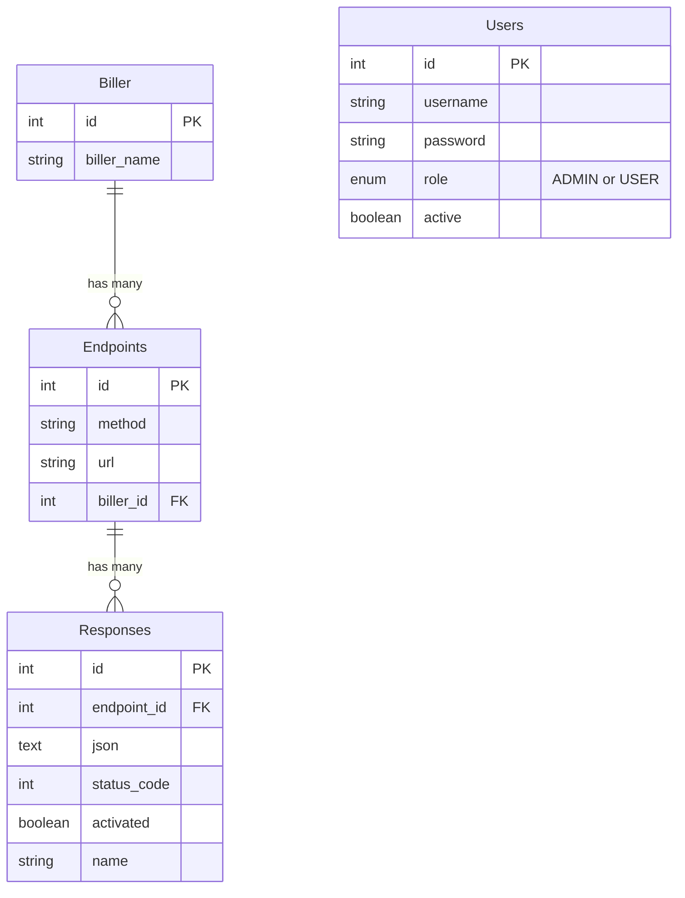

# API Specification

## Database Schema



## Dynamic Endpoint Handler

### `POST | GET | PUT | PATCH | DELETE /{endpoint}`

**Behavior:**

1. Search for endpoint in database
2. If not found, return `404`
3. If found and active response exists, send active response
4. Otherwise, return empty object `{}`

**Note:** This endpoint does NOT require authentication

---

## Authentication

All endpoints below require **JWT Bearer Token** authentication.

### Token Payload Structure

```json
{
  "user_id": "user_id",
  "role": "Users.role",
  "username": "username"
}
```

---

## Public Endpoints

### Login

**`POST /login`**

Authenticates a user and returns a JWT token.

**Request:**

```json
{
  "username": "nama",
  "password": "passwordnya"
}
```

**Response:**

```json
{
  "response_code": "00",
  "response_desc": "success",
  "token": "jwt.token.save"
}
```

---

## Biller Management

**Authorization:** All biller endpoints require authentication (accessible to both `ADMIN` and `USER` roles).

### List All Billers

**`GET /api/biller`**

Returns all billers in the system.

**Authorization:** Authenticated users (both `ADMIN` and `USER` roles)

**Response:**

```json
{
  "response_code": "00",
  "response_desc": "success",
  "billers": [
    {
      "id": 1,
      "biller_name": "PLN"
    },
    {
      "id": 2,
      "biller_name": "PDAM"
    },
    {
      "id": 3,
      "biller_name": "Telkom"
    }
  ]
}
```

---

### Get Biller by ID

**`GET /api/biller/{id}`**

Returns details of a specific biller.

**Authorization:** Authenticated users (both `ADMIN` and `USER` roles)

**Response:**

```json
{
  "response_code": "00",
  "response_desc": "success",
  "biller": {
    "id": 1,
    "biller_name": "PLN"
  }
}
```

---

### Search Biller by Name

**`GET /api/biller/search?name={billerName}`**

Search for a biller by name (case-insensitive).

**Authorization:** Authenticated users (both `ADMIN` and `USER` roles)

**Query Parameters:**

- `name` (required): The biller name to search for

**Example Request:**

```
GET /api/biller/search?name=PLN
```

**Response:**

```json
{
  "response_code": "00",
  "response_desc": "success",
  "biller": {
    "id": 1,
    "biller_name": "PLN"
  }
}
```

**Error Response (Not Found):**

```json
{
  "response_code": "99",
  "response_desc": "Biller dengan nama 'XYZ' tidak ditemukan"
}
```

---

## Configuration Management

**Authorization:** All configuration endpoints require authentication with `ADMIN` role.

### Endpoint Management

#### Create Endpoint

**`POST /api/endpoint`**

Creates a new endpoint configuration.

**Authorization:** Role must be `ADMIN`

**Request:**

```json
{
  "method": "POST",
  "url": "/payment/inquiry",
  "billerId": 1
}
```

**Note:**

- `billerId` is **required** and must reference an existing biller ID from the `biller` table
- `url` should NOT contain billerId - keep paths clean (e.g., `/payment/inquiry`, not `/1/payment/inquiry`)

**Response:**

```json
{
  "response_code": "00",
  "response_desc": "success",
  "endpoint": {
    "id": 1,
    "method": "POST",
    "url": "/payment/inquiry",
    "biller_id": 1,
    "biller_name": "PLN"
  }
}
```

---

#### List All Endpoints (Admin)

**`GET /api/endpoint`**

Lists all endpoints with their responses (admin view).

**Authorization:** Role must be `ADMIN`

**Response:**

```json
{
  "response_code": "00",
  "response_desc": "success",
  "endpoints": [
    {
      "endpoint_id": 1,
      "method": "POST",
      "url": "/payment/inquiry",
      "biller_id": 1,
      "biller_name": "PLN",
      "responses": [
        {
          "response_id": 1,
          "json": "{\"accountNumber\":\"1234567890\",\"balance\":150000}",
          "status_code": 200,
          "activated": true,
          "name": "Success Response"
        },
        {
          "response_id": 2,
          "json": "{\"errorCode\":\"ACCOUNT_NOT_FOUND\"}",
          "status_code": 404,
          "activated": false,
          "name": "Error Response"
        }
      ]
    }
  ]
}
```

---

#### Get Endpoint by ID

**`GET /api/endpoint/{id}`**

Get a specific endpoint by ID with its responses.

**Authorization:** Role must be `ADMIN`

**Response:**

```json
{
  "response_code": "00",
  "response_desc": "success",
  "endpoint": {
    "endpoint_id": 1,
    "method": "POST",
    "url": "/payment/inquiry",
    "biller_id": 1,
    "biller_name": "PLN",
    "responses": [
      {
        "response_id": 1,
        "json": "{\"accountNumber\":\"1234567890\",\"balance\":150000}",
        "status_code": 200,
        "activated": true,
        "name": "Success Response"
      }
    ]
  }
}
```

---

#### Update Endpoint

**`PUT /api/endpoint/{id}`**

Updates an existing endpoint.

**Authorization:** Role must be `ADMIN`

**Request:**

```json
{
  "method": "POST",
  "url": "/payment/verify",
  "billerId": 2
}
```

**Response:**

```json
{
  "response_code": "00",
  "response_desc": "success",
  "endpoint": {
    "id": 1,
    "method": "POST",
    "url": "/payment/verify",
    "biller_id": 2,
    "biller_name": "PDAM"
  }
}
```

---

#### Delete Endpoint

**`DELETE /api/endpoint/{id}`**

Deletes an endpoint.

**Authorization:** Role must be `ADMIN`

**Response:**

```json
{
  "response_code": "00",
  "response_desc": "success"
}
```

---

### Response Configuration Management

#### Create Response

**`POST /api/response`**

Adds a new response configuration for an endpoint.

**Authorization:** Role must be `ADMIN`

**Request:**

```json
{
  "endpointId": 1,
  "json": "{\"abc\": \"def\"}",
  "statusCode": "200",
  "activated": "0",
  "name": "response_success"
}
```

**Response:**

```json
{
  "response_code": "00",
  "response_desc": "success",
  "response": {
    "id": 4,
    "endpointId": 1,
    "json": "{\"abc\": \"def\"}",
    "statusCode": "200",
    "activated": "0",
    "name": "response_success"
  }
}
```

---

#### List All Responses

**`GET /api/response`**

Lists all response configurations.

**Authorization:** Role must be `ADMIN`

**Response:**

```json
{
  "response_code": "00",
  "response_desc": "success",
  "responses": [
    {
      "id": 4,
      "endpointId": 1,
      "json": "{\"abc\": \"def\"}",
      "statusCode": "200",
      "activated": "1",
      "name": "response_success"
    }
  ]
}
```

---

#### Get Response by ID

**`GET /api/response/{id}`**

Get a specific response configuration by ID.

**Authorization:** Role must be `ADMIN`

**Response:**

```json
{
  "response_code": "00",
  "response_desc": "success",
  "response": {
    "id": 4,
    "endpointId": 1,
    "json": "{\"abc\": \"def\"}",
    "statusCode": "200",
    "activated": "1",
    "name": "response_success"
  }
}
```

---

#### Update Response

**`PUT /api/response/{id}`**

Updates an existing response configuration.

**Authorization:** Role must be `ADMIN`

**Request:**

```json
{
  "endpointId": 1,
  "json": "{\"updated\": \"data\"}",
  "statusCode": "201",
  "activated": "0",
  "name": "response_updated"
}
```

**Response:**

```json
{
  "response_code": "00",
  "response_desc": "success",
  "response": {
    "id": 4,
    "endpointId": 1,
    "json": "{\"updated\": \"data\"}",
    "statusCode": "201",
    "activated": "0",
    "name": "response_updated"
  }
}
```

---

#### Activate Response

**`PUT /api/response/{endpointId}/{responseId}/activate`**

Sets a response as the active response for an endpoint. Deactivates all other responses for that endpoint.

**Authorization:** Role must be `ADMIN`

**Response:**

```json
{
  "response_code": "00",
  "response_desc": "success",
  "response": {
    "id": 4,
    "endpointId": 1,
    "json": "{\"abc\": \"def\"}",
    "statusCode": "200",
    "activated": "1",
    "name": "response_success"
  }
}
```

---

#### Deactivate Response

**`PUT /api/response/{endpointId}/{responseId}/deactivate`**

Deactivates a specific response for an endpoint.

**Authorization:** Role must be `ADMIN`

**Response:**

```json
{
  "response_code": "00",
  "response_desc": "success",
  "response": {
    "id": 4,
    "endpointId": 1,
    "json": "{\"abc\": \"def\"}",
    "statusCode": "200",
    "activated": "0",
    "name": "response_success"
  }
}
```

---

#### Delete Response

**`DELETE /api/response/{id}`**

Deletes a response configuration.

**Authorization:** Role must be `ADMIN`

**Response:**

```json
{
  "response_code": "00",
  "response_desc": "success"
}
```

---

## Viewing Endpoints

### List All Endpoints (User View)

**`GET /endpoints`**

Returns all configured endpoints with their responses. This is a read-only view accessible to authenticated users.

**Authorization:** Authenticated users (both `ADMIN` and `USER` roles can view)

**Response:**

```json
{
  "response_code": "00",
  "response_desc": "success",
  "endpoints": [
    {
      "endpoint_id": 1,
      "method": "POST",
      "url": "/payment/inquiry",
      "biller_id": 1,
      "biller_name": "PLN",
      "responses": [
        {
          "response_id": 1,
          "json": "{\"accountNumber\":\"1234567890\",\"balance\":150000}",
          "status_code": 200,
          "activated": true,
          "name": "Success Response"
        },
        {
          "response_id": 2,
          "json": "{\"errorCode\":\"ACCOUNT_NOT_FOUND\"}",
          "status_code": 404,
          "activated": false,
          "name": "Error Response"
        }
      ]
    },
    {
      "endpoint_id": 2,
      "method": "POST",
      "url": "/payment/process",
      "biller_id": 2,
      "biller_name": "PDAM",
      "responses": []
    }
  ]
}
```

---

## User Management

**All user management endpoints require `ADMIN` role.**

### List All Users

**`GET /users`**

Returns all users in the system.

**Authorization:** Role must be `ADMIN`

**Response:**

```json
{
  "response_code": "00",
  "response_desc": "success",
  "users": [
    {
      "user_id": 2,
      "username": "user",
      "role": "USER",
      "active": true
    },
    {
      "user_id": 3,
      "username": "resu",
      "role": "USER",
      "active": false
    }
  ]
}
```

---

### Get User by ID

**`GET /users/{user_id}`**

Returns details of a specific user.

**Authorization:** Role must be `ADMIN`

**Response:**

```json
{
  "response_code": "00",
  "response_desc": "success",
  "user": {
    "user_id": 2,
    "username": "user",
    "role": "USER",
    "active": true
  }
}
```

---

### Create User

**`POST /users/add`**

Creates a new user.

**Authorization:** Role must be `ADMIN`

**Request:**

```json
{
  "username": "abcdef",
  "password": "password"
}
```

**Response:**

```json
{
  "response_code": "00",
  "response_desc": "success",
  "user_id": 6
}
```

---

### Update User

**`PATCH /users/{user_id}`**

Updates user information. Multiple request body formats supported.

**Authorization:**

- Role must be `ADMIN`
- Cannot edit users with `ADMIN` role

**Request (Update Username):**

```json
{
  "username": "abcdef"
}
```

**Request (Update Active Status):**

```json
{
  "active": false
}
```

**Response:**

```json
{
  "response_code": "00",
  "response_desc": "success"
}
```

---

### Delete User

**`DELETE /users/{user_id}`**

Deletes a user from the system.

**Authorization:**

- Role must be `ADMIN`
- Cannot delete users with `ADMIN` role

**Response:**

```json
{
  "response_code": "00",
  "response_desc": "success"
}
```

---

## Response Codes

| Code  | Description        |
| ----- | ------------------ |
| `00`  | Success            |
| `404` | Endpoint not found |

_Note: Additional error codes may be defined as needed_
