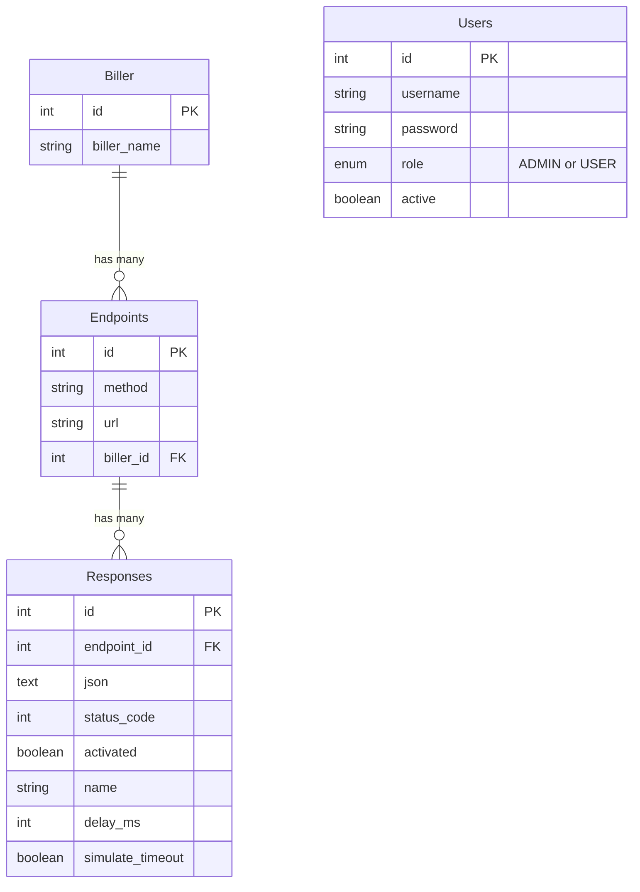

# API Specification

## Database Schema



## Dynamic Endpoint Handler

### `POST | GET | PUT | PATCH | DELETE /{endpoint}`

**Behavior:**

1. Search for endpoint in database
2. If not found, return `404`
3. If found and active response exists:
   - If `simulateTimeout = true`: Hold connection indefinitely (never send response, client will timeout)
   - If `delayMs > 0`: Wait for specified milliseconds, then send response
   - Otherwise: Send response immediately
4. If no active response exists, return empty object `{}`

**Note:** This endpoint does NOT require authentication

**Simulation Features:**

The dynamic endpoint supports two types of network simulation:

1. **Latency Simulation** (`delayMs`):

   - Delays response by specified milliseconds
   - Example: `delayMs = 500` waits 500ms before sending response
   - Useful for testing slow network conditions

2. **Timeout Simulation** (`simulateTimeout`):
   - Holds the connection indefinitely without sending any response
   - Client will eventually timeout based on their timeout settings
   - Useful for testing timeout handling in client applications

---

## Authentication

All endpoints below require **JWT Bearer Token** authentication.

### Token System

The application uses a dual-token authentication system:

1. **Access Token** (short-lived, 15 minutes)

   - Used for API authentication
   - Sent in `Authorization: Bearer {accessToken}` header
   - Contains `token_type: "access"` claim

2. **Refresh Token** (long-lived, 7 days)
   - Used to obtain new access tokens
   - Sent only to `/refresh` endpoint
   - Contains `token_type: "refresh"` claim

### Token Payload Structure

Both access and refresh tokens contain the following claims:

```json
{
  "user_id": "user_id",
  "role": "Users.role",
  "username": "username",
  "token_type": "access | refresh",
  "iat": 1234567890,
  "exp": 1234568790
}
```

**Claim Descriptions:**

- `user_id`: The user's unique identifier
- `role`: User role (ADMIN or USER)
- `username`: The user's username
- `token_type`: Token type ("access" or "refresh")
- `iat`: Issued at timestamp (Unix epoch)
- `exp`: Expiration timestamp (Unix epoch)

---

## Public Endpoints

### Login

**`POST /login`**

Authenticates a user and returns both access and refresh tokens.

**Request:**

```json
{
  "username": "nama",
  "password": "passwordnya"
}
```

**Response:**

```json
{
  "code": "00",
  "message": "Success",
  "data": {
    "accessToken": "eyJhbGciOiJIUzI1NiJ9...",
    "refreshToken": "eyJhbGciOiJIUzI1NiJ9...",
    "tokenType": "Bearer",
    "expiresIn": 900
  }
}
```

**Response Fields:**

- `accessToken`: Short-lived token (15 minutes) used for API requests
- `refreshToken`: Long-lived token (7 days) used to obtain new access tokens
- `tokenType`: Always "Bearer"
- `expiresIn`: Access token expiration time in seconds (900 = 15 minutes)

---

### Refresh Token

**`POST /refresh`**

Use a refresh token to obtain new access and refresh tokens without re-authentication.

**Request:**

```json
{
  "refreshToken": "eyJhbGciOiJIUzI1NiJ9..."
}
```

**Response:**

```json
{
  "code": "00",
  "message": "Success",
  "data": {
    "accessToken": "eyJhbGciOiJIUzI1NiJ9...",
    "refreshToken": "eyJhbGciOiJIUzI1NiJ9...",
    "tokenType": "Bearer",
    "expiresIn": 900
  }
}
```

**Error Response (Invalid Token):**

```json
{
  "code": "401",
  "message": "Invalid or expired refresh token"
}
```

**Error Response (User Deactivated):**

```json
{
  "code": "401",
  "message": "User account is deactivated"
}
```

**Notes:**

- Refresh tokens are single-use - each refresh generates new tokens
- Both access and refresh tokens are rotated on each refresh
- If refresh token is expired, user must login again
- Refresh tokens are validated to ensure user still exists and is active

---

## Biller Management

**Authorization:** All biller endpoints require authentication (accessible to both `ADMIN` and `USER` roles).

### List All Billers

**`GET /api/biller`**

Returns all billers in the system.

**Authorization:** Authenticated users (both `ADMIN` and `USER` roles)

**Response:**

```json
{
  "response_code": "00",
  "response_desc": "success",
  "billers": [
    {
      "id": 1,
      "biller_name": "PLN"
    },
    {
      "id": 2,
      "biller_name": "PDAM"
    },
    {
      "id": 3,
      "biller_name": "Telkom"
    }
  ]
}
```

---

### Get Biller by ID

**`GET /api/biller/{id}`**

Returns details of a specific biller.

**Authorization:** Authenticated users (both `ADMIN` and `USER` roles)

**Response:**

```json
{
  "response_code": "00",
  "response_desc": "success",
  "biller": {
    "id": 1,
    "biller_name": "PLN"
  }
}
```

---

### Search Biller by Name

**`GET /api/biller/search?name={billerName}`**

Search for a biller by name (case-insensitive).

**Authorization:** Authenticated users (both `ADMIN` and `USER` roles)

**Query Parameters:**

- `name` (required): The biller name to search for

**Example Request:**

```
GET /api/biller/search?name=PLN
```

**Response:**

```json
{
  "response_code": "00",
  "response_desc": "success",
  "biller": {
    "id": 1,
    "biller_name": "PLN"
  }
}
```

**Error Response (Not Found):**

```json
{
  "response_code": "99",
  "response_desc": "Biller dengan nama 'XYZ' tidak ditemukan"
}
```

---

## Configuration Management

**Authorization:** All configuration endpoints require authentication with `ADMIN` role.

### Endpoint Management

#### Create Endpoint

**`POST /api/endpoint`**

Creates a new endpoint configuration.

**Authorization:** Role must be `ADMIN`

**Request:**

```json
{
  "method": "POST",
  "url": "/payment/inquiry",
  "billerId": 1
}
```

**Note:**

- `billerId` is **required** and must reference an existing biller ID from the `biller` table
- `url` should NOT contain billerId - keep paths clean (e.g., `/payment/inquiry`, not `/1/payment/inquiry`)

**Response:**

```json
{
  "response_code": "00",
  "response_desc": "success",
  "endpoint": {
    "id": 1,
    "method": "POST",
    "url": "/payment/inquiry",
    "biller_id": 1,
    "biller_name": "PLN"
  }
}
```

---

#### List All Endpoints (Admin)

**`GET /api/endpoint`**

Lists all endpoints with their responses (admin view).

**Authorization:** Role must be `ADMIN`

**Response:**

```json
{
  "response_code": "00",
  "response_desc": "success",
  "endpoints": [
    {
      "endpoint_id": 1,
      "method": "POST",
      "url": "/payment/inquiry",
      "biller_id": 1,
      "biller_name": "PLN",
      "responses": [
        {
          "response_id": 1,
          "json": "{\"accountNumber\":\"1234567890\",\"balance\":150000}",
          "status_code": 200,
          "activated": true,
          "name": "Success Response"
        },
        {
          "response_id": 2,
          "json": "{\"errorCode\":\"ACCOUNT_NOT_FOUND\"}",
          "status_code": 404,
          "activated": false,
          "name": "Error Response"
        }
      ]
    }
  ]
}
```

---

#### Get Endpoint by ID

**`GET /api/endpoint/{id}`**

Get a specific endpoint by ID with its responses.

**Authorization:** Role must be `ADMIN`

**Response:**

```json
{
  "response_code": "00",
  "response_desc": "success",
  "endpoint": {
    "endpoint_id": 1,
    "method": "POST",
    "url": "/payment/inquiry",
    "biller_id": 1,
    "biller_name": "PLN",
    "responses": [
      {
        "response_id": 1,
        "json": "{\"accountNumber\":\"1234567890\",\"balance\":150000}",
        "status_code": 200,
        "activated": true,
        "name": "Success Response"
      }
    ]
  }
}
```

---

#### Update Endpoint

**`PUT /api/endpoint/{id}`**

Updates an existing endpoint.

**Authorization:** Role must be `ADMIN`

**Request:**

```json
{
  "method": "POST",
  "url": "/payment/verify",
  "billerId": 2
}
```

**Response:**

```json
{
  "response_code": "00",
  "response_desc": "success",
  "endpoint": {
    "id": 1,
    "method": "POST",
    "url": "/payment/verify",
    "biller_id": 2,
    "biller_name": "PDAM"
  }
}
```

---

#### Delete Endpoint

**`DELETE /api/endpoint/{id}`**

Deletes an endpoint.

**Authorization:** Role must be `ADMIN`

**Response:**

```json
{
  "response_code": "00",
  "response_desc": "success"
}
```

---

### Response Configuration Management

#### Create Response

**`POST /api/response`**

Adds a new response configuration for an endpoint.

**Authorization:** Role must be `ADMIN`

**Request:**

```json
{
  "endpointId": 1,
  "json": "{\"abc\": \"def\"}",
  "statusCode": "200",
  "activated": "0",
  "name": "response_success",
  "delayMs": 0,
  "simulateTimeout": false
}
```

**Request Fields:**

- `endpointId` (required): The endpoint ID this response belongs to
- `json` (required): The JSON response body (as a string)
- `statusCode` (required): HTTP status code to return
- `activated` (required): "0" for inactive, "1" for active
- `name` (required): Name/description of this response
- `delayMs` (optional): Milliseconds to delay before sending response (default: 0)
- `simulateTimeout` (optional): Hold connection indefinitely to simulate timeout (default: false)

**Important:** You cannot set both `delayMs > 0` and `simulateTimeout = true` at the same time.

**Response:**

```json
{
  "response_code": "00",
  "response_desc": "success",
  "response": {
    "id": 4,
    "endpointId": 1,
    "json": "{\"abc\": \"def\"}",
    "statusCode": "200",
    "activated": "0",
    "name": "response_success",
    "delayMs": 0,
    "simulateTimeout": false
  }
}
```

**Special Behaviors:**

- If this is the first response for an endpoint, it will be automatically activated (activated = "1")
- The `json` field is validated and canonicalized to ensure valid JSON format

---

#### List All Responses

**`GET /api/response`**

Lists all response configurations.

**Authorization:** Role must be `ADMIN`

**Response:**

```json
{
  "response_code": "00",
  "response_desc": "success",
  "responses": [
    {
      "id": 4,
      "endpointId": 1,
      "json": "{\"abc\": \"def\"}",
      "statusCode": "200",
      "activated": "1",
      "name": "response_success",
      "delayMs": 0,
      "simulateTimeout": false
    }
  ]
}
```

---

#### Get Response by ID

**`GET /api/response/{id}`**

Get a specific response configuration by ID.

**Authorization:** Role must be `ADMIN`

**Response:**

```json
{
  "response_code": "00",
  "response_desc": "success",
  "response": {
    "id": 4,
    "endpointId": 1,
    "json": "{\"abc\": \"def\"}",
    "statusCode": "200",
    "activated": "1",
    "name": "response_success",
    "delayMs": 0,
    "simulateTimeout": false
  }
}
```

---

#### Update Response

**`PUT /api/response/{id}`**

Updates an existing response configuration (full update - all fields required).

**Authorization:** Role must be `ADMIN`

**Request:**

```json
{
  "endpointId": 1,
  "json": "{\"updated\": \"data\"}",
  "statusCode": "201",
  "activated": "0",
  "name": "response_updated",
  "delayMs": 500,
  "simulateTimeout": false
}
```

**Important:** You cannot set both `delayMs > 0` and `simulateTimeout = true` at the same time.

**Response:**

```json
{
  "response_code": "00",
  "response_desc": "success",
  "response": {
    "id": 4,
    "endpointId": 1,
    "json": "{\"updated\": \"data\"}",
    "statusCode": "201",
    "activated": "0",
    "name": "response_updated",
    "delayMs": 500,
    "simulateTimeout": false
  }
}
```

---

#### Update Response Simulation Settings (Partial Update)

**`PATCH /api/response/{id}/simulation`**

Updates only the delay/timeout simulation settings without modifying other fields like JSON content, status code, or name.

**Authorization:** Role must be `ADMIN`

**Request:**

```json
{
  "delayMs": 1000,
  "simulateTimeout": false
}
```

**Request Fields (all optional):**

- `delayMs`: Milliseconds to delay before sending response (e.g., 100, 500, 3000)
- `simulateTimeout`: Boolean to enable/disable timeout simulation

**Important:** You cannot set both `delayMs > 0` and `simulateTimeout = true` at the same time.

**Use Cases:**

1. **Add latency simulation:**

```json
{
  "delayMs": 1000
}
```

2. **Enable timeout simulation:**

```json
{
  "simulateTimeout": true
}
```

3. **Reset to normal (no simulation):**

```json
{
  "delayMs": 0,
  "simulateTimeout": false
}
```

**Response:**

```json
{
  "response_code": "00",
  "response_desc": "success",
  "response": {
    "id": 4,
    "endpointId": 1,
    "json": "{\"abc\": \"def\"}",
    "statusCode": "200",
    "activated": "1",
    "name": "response_success",
    "delayMs": 1000,
    "simulateTimeout": false
  }
}
```

**Notes:**

- This is a partial update - only provided fields are updated
- Other response fields (json, statusCode, name, activated, endpointId) remain unchanged
- Useful for quickly switching between different simulation scenarios without re-uploading the entire response configuration

---

#### Activate Response

**`PUT /api/response/{endpointId}/{responseId}/activate`**

Sets a response as the active response for an endpoint. Deactivates all other responses for that endpoint.

**Authorization:** Role must be `ADMIN`

**Response:**

```json
{
  "response_code": "00",
  "response_desc": "success",
  "response": {
    "id": 4,
    "endpointId": 1,
    "json": "{\"abc\": \"def\"}",
    "statusCode": "200",
    "activated": "1",
    "name": "response_success",
    "delayMs": 0,
    "simulateTimeout": false
  }
}
```

---

#### Deactivate Response

**`PUT /api/response/{endpointId}/{responseId}/deactivate`**

Deactivates a specific response for an endpoint.

**Authorization:** Role must be `ADMIN`

**Response:**

```json
{
  "response_code": "00",
  "response_desc": "success",
  "response": {
    "id": 4,
    "endpointId": 1,
    "json": "{\"abc\": \"def\"}",
    "statusCode": "200",
    "activated": "0",
    "name": "response_success",
    "delayMs": 0,
    "simulateTimeout": false
  }
}
```

---

#### Delete Response

**`DELETE /api/response/{id}`**

Deletes a response configuration.

**Authorization:** Role must be `ADMIN`

**Response:**

```json
{
  "response_code": "00",
  "response_desc": "success"
}
```

---

## Viewing Endpoints

### List All Endpoints (User View)

**`GET /endpoints`**

Returns all configured endpoints with their responses. This is a read-only view accessible to authenticated users.

**Authorization:** Authenticated users (both `ADMIN` and `USER` roles can view)

**Response:**

```json
{
  "response_code": "00",
  "response_desc": "success",
  "endpoints": [
    {
      "endpoint_id": 1,
      "method": "POST",
      "url": "/payment/inquiry",
      "biller_id": 1,
      "biller_name": "PLN",
      "responses": [
        {
          "response_id": 1,
          "json": "{\"accountNumber\":\"1234567890\",\"balance\":150000}",
          "status_code": 200,
          "activated": true,
          "name": "Success Response"
        },
        {
          "response_id": 2,
          "json": "{\"errorCode\":\"ACCOUNT_NOT_FOUND\"}",
          "status_code": 404,
          "activated": false,
          "name": "Error Response"
        }
      ]
    },
    {
      "endpoint_id": 2,
      "method": "POST",
      "url": "/payment/process",
      "biller_id": 2,
      "biller_name": "PDAM",
      "responses": []
    }
  ]
}
```

---

## User Management

**All user management endpoints require `ADMIN` role.**

### List All Users

**`GET /users`**

Returns all users in the system.

**Authorization:** Role must be `ADMIN`

**Response:**

```json
{
  "response_code": "00",
  "response_desc": "success",
  "users": [
    {
      "user_id": 2,
      "username": "user",
      "role": "USER",
      "active": true
    },
    {
      "user_id": 3,
      "username": "resu",
      "role": "USER",
      "active": false
    }
  ]
}
```

---

### Get User by ID

**`GET /users/{user_id}`**

Returns details of a specific user.

**Authorization:** Role must be `ADMIN`

**Response:**

```json
{
  "response_code": "00",
  "response_desc": "success",
  "user": {
    "user_id": 2,
    "username": "user",
    "role": "USER",
    "active": true
  }
}
```

---

### Create User

**`POST /users/add`**

Creates a new user.

**Authorization:** Role must be `ADMIN`

**Request:**

```json
{
  "username": "abcdef",
  "password": "password"
}
```

**Response:**

```json
{
  "response_code": "00",
  "response_desc": "success",
  "user_id": 6
}
```

---

### Update User

**`PATCH /users/{user_id}`**

Updates user information. Multiple request body formats supported.

**Authorization:**

- Role must be `ADMIN`
- Cannot edit users with `ADMIN` role

**Request (Update Username):**

```json
{
  "username": "abcdef"
}
```

**Request (Update Active Status):**

```json
{
  "active": false
}
```

**Response:**

```json
{
  "response_code": "00",
  "response_desc": "success"
}
```

---

### Delete User

**`DELETE /users/{user_id}`**

Deletes a user from the system.

**Authorization:**

- Role must be `ADMIN`
- Cannot delete users with `ADMIN` role

**Response:**

```json
{
  "response_code": "00",
  "response_desc": "success"
}
```

---

## Response Codes

| Code  | Description        |
| ----- | ------------------ |
| `00`  | Success            |
| `404` | Endpoint not found |

_Note: Additional error codes may be defined as needed_
